# Multi-Center Sagittal L-Spine MRI Multi-Label Object Detection Dataset

Documentation of a retrospective multi-center sagittal lumbar-spine MRI dataset developed for multi-label vertebral lesion object detection.

## Overview

This repository documents the structure, annotation format, and class definitions of a multi-center retrospective spine MRI dataset developed for spinal lesion object detection.

The dataset itself is **not included in this repository** because it contains restricted clinical imaging data. This repository only provides documentation, annotation examples, class definitions, and code-compatible data format specifications.

The dataset is designed for **multi-label object detection**, where a single vertebral lesion or surgical region may be associated with multiple diagnostic labels.

For example, one vertebral body may simultaneously contain:

* Vertebral compression fracture
* Bone cement
* Kummell's disease

These labels are assigned to a single bounding box using a multi-label annotation format.

---

## Task Definition

The primary task is:

> Detection and multi-label classification of spinal lesions on MRI images.

Given a spine MRI image, the model predicts:

1. The location of each lesion using a bounding box
2. One or more diagnostic labels associated with each bounding box

This differs from conventional single-label object detection because one detected object can have multiple labels.

### Example

```text
Bounding box 1
├── VCF
├── Cement
└── Kummell's Disease
```

---

## Data Source

The dataset consists of retrospectively collected spine MRI images from multiple medical centers.

* Study design: Multi-center retrospective study
* Modality: Spine MRI
* Primary task: Spinal lesion object detection
* Annotation type: Bounding box with multi-label classification
* Number of classes: 9
* Data availability: Restricted clinical dataset
* Public release: Not available

All clinical data should be handled according to the relevant institutional review board, data governance, and patient privacy requirements.

---

## Study Cohort and Ethical Approval

This retrospective multi-center study included lumbar-spine MRI examinations collected from six tertiary academic hospitals affiliated with **The Catholic University of Korea**.

Institutional Review Board approval was obtained from the participating institutions.

- **IRB approval number:** `HC23WIDB0074`
- **Study design:** Retrospective multi-center study
- **Participating institutions:** Six tertiary academic hospitals
- **Study period:** March 2013 to February 2023
- **Total number of patients:** 733
- **Data handling:** All images were de-identified before analysis
- **Dataset split:** Patient-level split to prevent data leakage

The cohort included patients who underwent lumbar-spine MRI and bone biopsy and were diagnosed with vertebral compression fracture or metastatic spinal tumors. Sagittal T1-weighted and T2-weighted MRI scans acquired during clinical evaluation of vertebral fractures and tumor-related conditions were used.

### Participating Hospitals

- Seoul St. Mary's Hospital
- Incheon St. Mary's Hospital
- Bucheon St. Mary's Hospital
- Uijeongbu St. Mary's Hospital
- Yeouido St. Mary's Hospital
- St. Vincent's Hospital

### Annotation Protocol

Vertebral bodies were annotated with axis-aligned bounding boxes by clinicians specializing in spine disease. Annotation decisions were based on radiology reports and imaging findings and were verified through consensus review.

Each bounding box could receive one or more labels, allowing pathological and procedural findings to coexist in the same vertebral body.

The nine labels were:

1. Fracture
2. Chronic fracture
3. Vertebroplasty
4. Screw fixation
5. Hemangioma
6. Malignant
7. Schmorl's node
8. Kummell's disease
9. Spondylitis

In this repository, the corresponding internal class names are:

| Paper terminology | Repository class name |
|---|---|
| Fracture | VCF |
| Chronic fracture | Old VCF |
| Vertebroplasty | Cement |
| Screw fixation | Fixation |
| Hemangioma | Hemangioma |
| Malignant | Malignant |
| Schmorl's node | Schmorl's Node |
| Kummell's disease | Kummell's Disease |
| Spondylitis | Infection |

---

## Dataset Statistics

The dataset was divided at the **patient level** into training, validation, and test sets. Therefore, images from the same patient were not assigned to multiple splits.

| Split | Patients | Images | Bounding boxes | Mean labels per box |
|---|---:|---:|---:|---:|
| Training | 586 | 10,483 | 26,371 | 1.37 |
| Validation | 73 | 1,280 | 3,592 | 1.29 |
| Test | 74 | 1,446 | 3,489 | 1.33 |
| **Total** | **733** | **13,209** | **33,452** | **1.35** |

The image split corresponds approximately to:

| Split | Image proportion |
|---|---:|
| Training | 79.36% |
| Validation | 9.69% |
| Test | 10.95% |

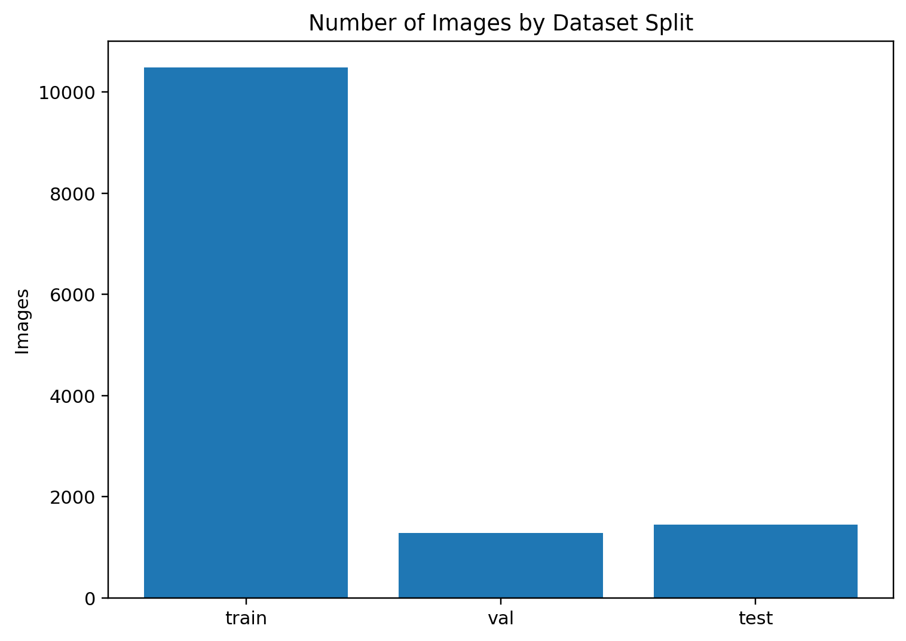

### Class Frequencies

Because one bounding box may contain multiple labels, the sum of class frequencies exceeds the total number of bounding boxes.

| Class ID | Repository class | Paper terminology | Number of labels |
|---:|---|---|---:|
| 0 | VCF | Fracture | 16,066 |
| 1 | Old VCF | Chronic fracture | 8,343 |
| 2 | Cement | Vertebroplasty | 3,040 |
| 3 | Fixation | Screw fixation | 2,859 |
| 4 | Hemangioma | Hemangioma | 629 |
| 5 | Malignant | Malignant | 7,045 |
| 6 | Schmorl's Node | Schmorl's node | 3,900 |
| 7 | Kummell's Disease | Kummell's disease | 1,649 |
| 8 | Infection | Spondylitis | 1,759 |
|  | **Total class assignments** |  | **45,290** |

The overall mean of `1.35` labels per bounding box is consistent with the multi-label annotation design.

### Class Distribution

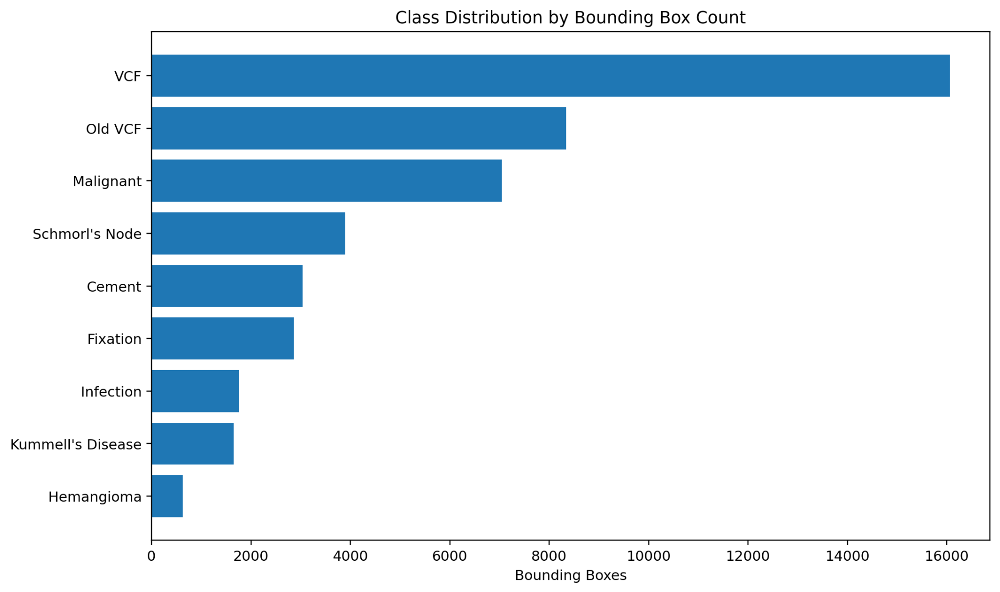

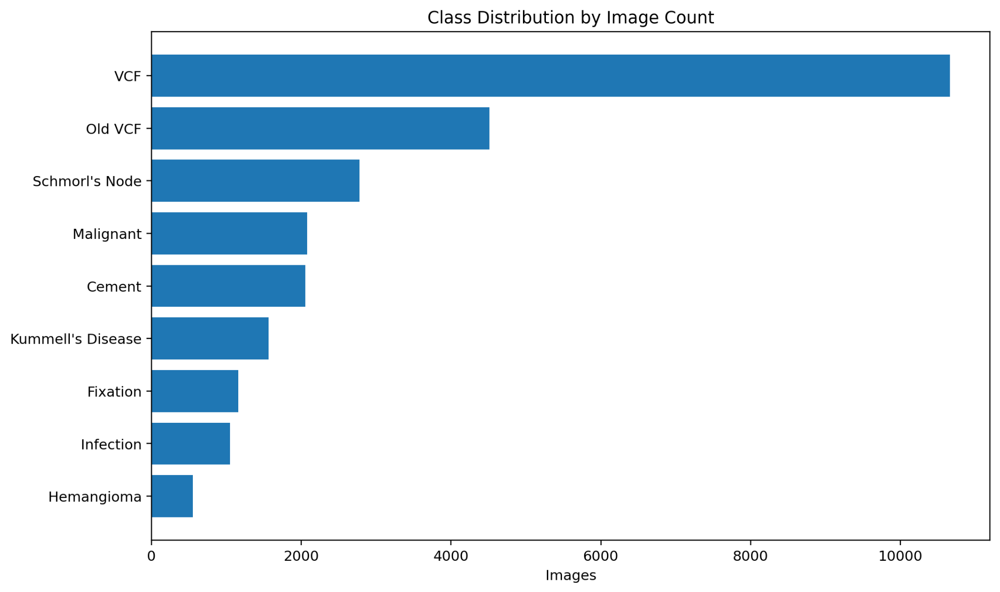

The dataset is substantially imbalanced:

- `VCF` is the most frequent label.
- `Old VCF` and `Malignant` are also common.
- `Hemangioma` is the rarest class.
- `Kummell's Disease` and `Infection` are relatively uncommon.
- A single image may contain several annotated vertebral levels, so box counts can be considerably higher than image counts.

This imbalance should be considered when selecting class-weighting schemes, sampling methods, loss functions, and class-specific confidence thresholds.

### Bounding Boxes per Image

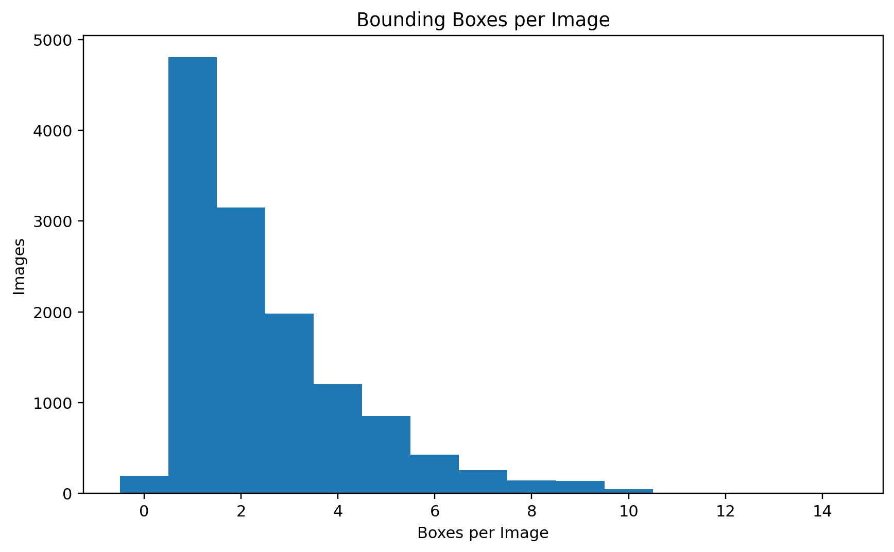

Most images contain one to three bounding boxes, whereas a smaller subset contains several abnormal vertebral levels. The right-skewed distribution is consistent with examinations containing multilevel fractures, metastatic lesions, postoperative levels, or multiple endplate abnormalities.

### Labels per Bounding Box

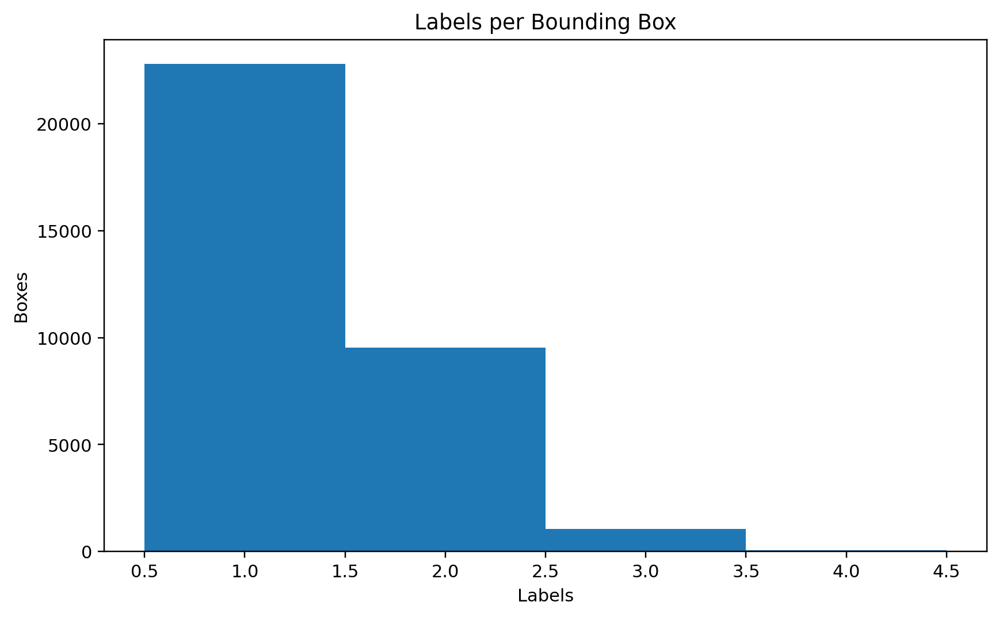

Most boxes contain a single label, but a substantial proportion contains two labels. Boxes with three labels occur less frequently.

Common combinations include:

```text
VCF + Malignant
Old VCF + Cement
Old VCF + Schmorl's Node
VCF + Kummell's Disease
VCF + Infection
VCF + Cement
```

### Bounding-Box Geometry

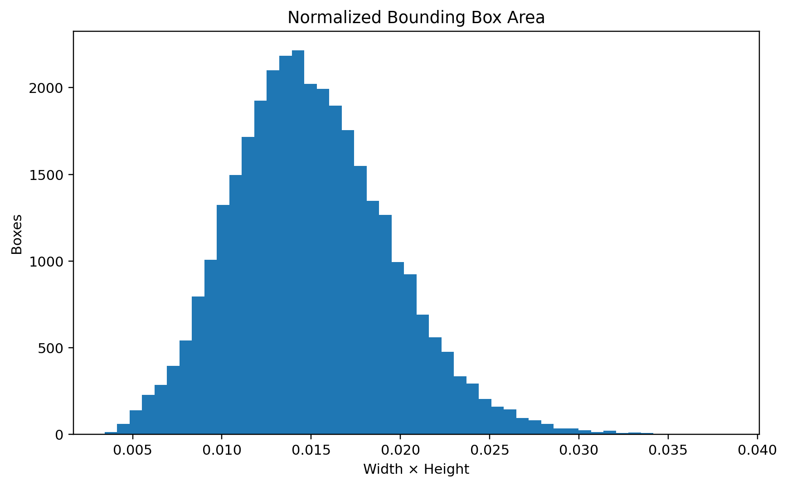

Most boxes occupy a relatively small portion of the full sagittal MRI image, which is consistent with vertebral-body-level annotation.

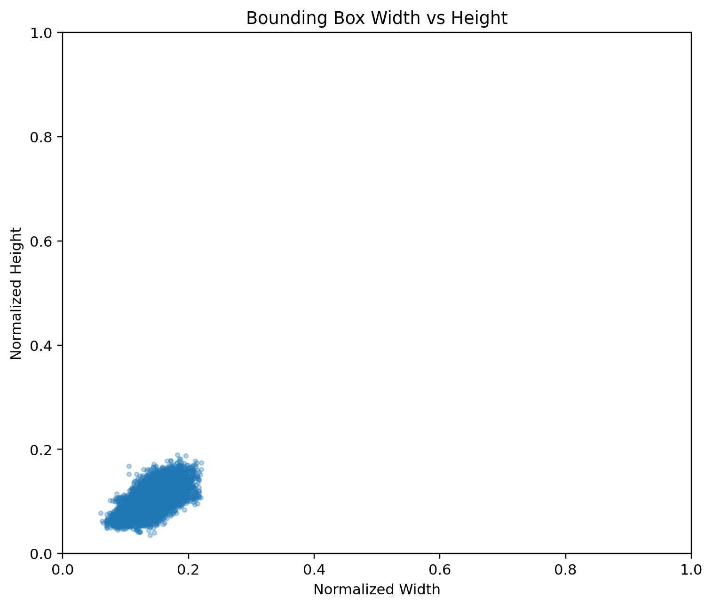

The width-height distribution forms a compact cluster, showing relatively consistent annotation geometry across the dataset.

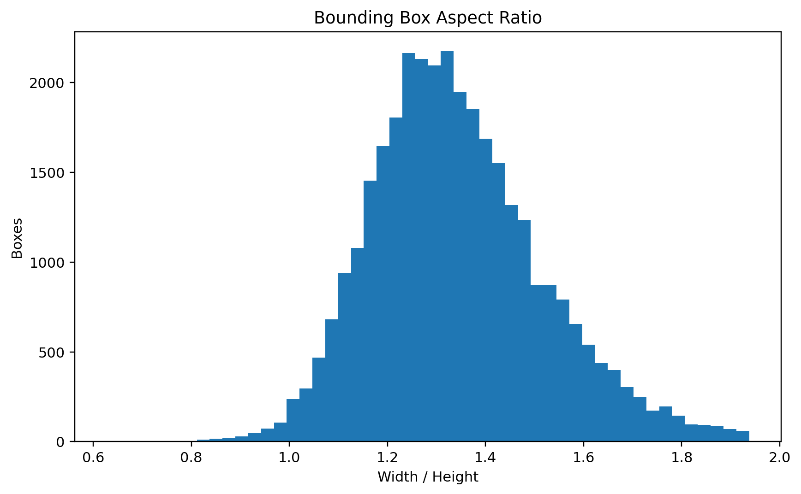

Most boxes are wider than they are tall, with a width-to-height ratio concentrated around approximately `1.2–1.5`, reflecting the projected shape of vertebral bodies on sagittal MRI.

### Multi-Label Combinations

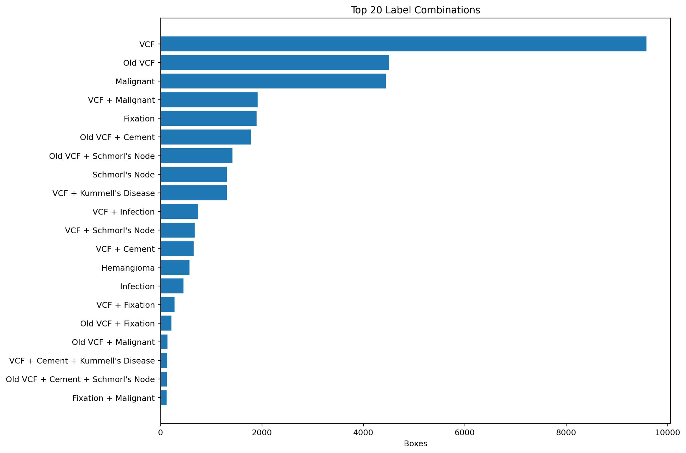

Single-label `VCF`, `Old VCF`, and `Malignant` annotations are common. Frequent multi-label combinations demonstrate that structural collapse, underlying disease, and procedural status may coexist in the same vertebral body.

### Class Co-Occurrence

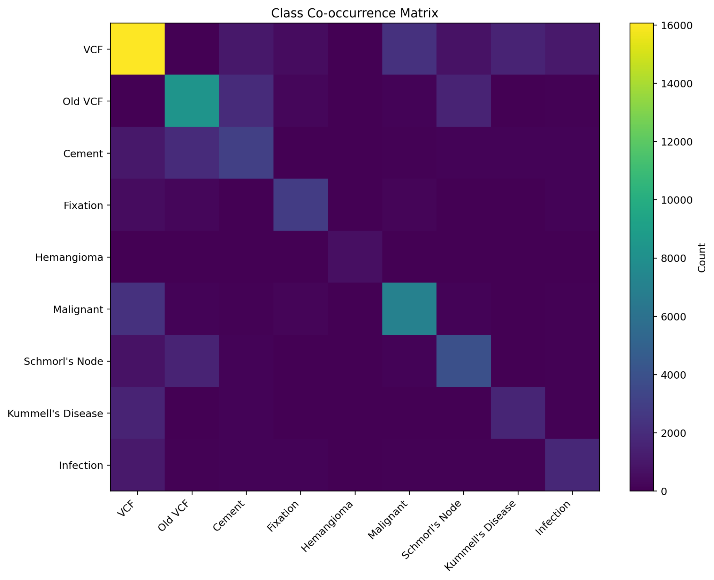

The diagonal represents individual class frequency. Off-diagonal cells represent labels assigned together to the same bounding box.

Notable patterns include:

- `VCF` commonly co-occurs with `Malignant`.
- `VCF` also co-occurs with `Kummell's Disease`, `Infection`, `Cement`, and `Fixation`.
- `Old VCF` frequently co-occurs with `Cement` and `Schmorl's Node`.
- `Hemangioma` is usually annotated as an isolated finding.

Because raw co-occurrence counts are influenced by class prevalence, normalized measures such as conditional frequency or Jaccard similarity may be useful for additional analysis.

### Original Image Dimensions

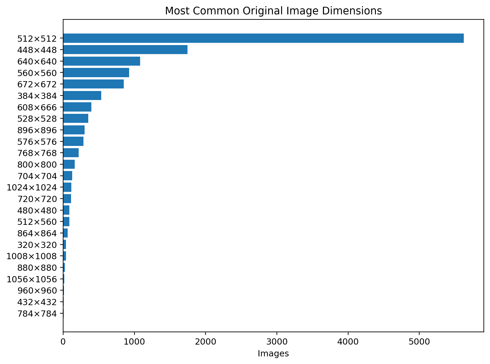

The source images have heterogeneous spatial resolutions. `512 × 512` is the most common resolution, followed by several other square and non-square formats. This heterogeneity likely reflects differences in scanner systems, institutional protocols, and image-export pipelines.

For model input, all images are resized to `640 × 640`.

### Dataset Characteristics

The dataset has the following principal characteristics:

1. **Multi-center heterogeneity** across six tertiary academic hospitals
2. **Patient-level split** with 586 training, 73 validation, and 74 test patients
3. **Strong class imbalance**, particularly between VCF and rare classes
4. **Multiple objects per image**, including multilevel spinal abnormalities
5. **Multi-label objects**, with a mean of 1.35 labels per bounding box
6. **Consistent vertebral-body-scale box geometry**
7. **Heterogeneous original image dimensions**

---

## Class Definitions

The dataset contains nine classes.

| Class ID | Class name        | Description                                                                    |
| -------: | ----------------- | ------------------------------------------------------------------------------ |
|        0 | VCF               | Vertebral compression fracture                                                 |
|        1 | Old VCF           | Chronic or old vertebral compression fracture                                  |
|        2 | Cement            | Vertebral body containing injected bone cement                                 |
|        3 | Fixation          | Spinal fixation hardware or postoperative fixation region                      |
|        4 | Hemangioma        | Vertebral hemangioma                                                           |
|        5 | Malignant         | Malignant vertebral lesion                                                     |
|        6 | Schmorl's Node    | Schmorl's node involving the vertebral endplate                                |
|        7 | Kummell's Disease | Kummell's disease or intravertebral vacuum cleft-associated vertebral collapse |
|        8 | Infection         | Infectious spinal lesion, including suspected spondylitis or osteomyelitis     |

### Important terminology

The annotation class is internally stored as:

```text
Schmrol's Node
```

However, the medically correct spelling is:

```text
Schmorl's Node
```

For future dataset versions, it is recommended to standardize the class name as `Schmorl's Node` while preserving the class ID as `6`.

---

## Multi-Label Annotation Policy

A single bounding box may contain more than one class.

Examples include:

| Clinical finding                                 | Labels                 |
| ------------------------------------------------ | ---------------------- |
| Acute compression fracture                       | VCF                    |
| Chronic compression fracture                     | Old VCF                |
| Compression fracture treated with vertebroplasty | VCF, Cement            |
| Kummell's disease with vertebral collapse        | VCF, Kummell's Disease |
| Postoperative malignant lesion                   | Malignant, Fixation    |
| Infected vertebral fracture                      | VCF, Infection         |

The multi-label design allows the dataset to represent coexisting pathological and postoperative findings without creating duplicated bounding boxes for the same anatomical object.

---

## Directory Structure

The dataset follows a YOLO-style directory structure.

```text
datasets_yolo_8_1_1/
├── images/
│   ├── train/
│   │   ├── image_000001.jpg
│   │   ├── image_000002.jpg
│   │   └── ...
│   ├── val/
│   │   ├── image_010001.jpg
│   │   └── ...
│   └── test/
│       ├── image_020001.jpg
│       └── ...
│
└── labels/
    ├── train/
    │   ├── image_000001.txt
    │   ├── image_000002.txt
    │   └── ...
    ├── val/
    │   ├── image_010001.txt
    │   └── ...
    └── test/
        ├── image_020001.txt
        └── ...
```

Each image must have a corresponding annotation file with the same relative path and filename.

Example:

```text
images/train/image_000001.jpg
labels/train/image_000001.txt
```

---

## Image Format

The current model pipeline uses the following preprocessing:

1. Load the MRI image
2. Convert the image to grayscale
3. Resize the image to `640 × 640`
4. Duplicate the grayscale channel into three channels
5. Normalize pixel values to the range `[0, 1]`

Example tensor shape:

```text
[3, 640, 640]
```

Although the images are represented as three-channel tensors, all three channels contain the same grayscale MRI information.

---

## Annotation Format

Each annotation file is a plain-text `.txt` file.

Each line represents one bounding box.

```text
<class_ids> <center_x> <center_y> <width> <height>
```

The bounding box coordinates follow the normalized YOLO format:

* `center_x`: normalized horizontal center coordinate
* `center_y`: normalized vertical center coordinate
* `width`: normalized bounding box width
* `height`: normalized bounding box height

All coordinate values are normalized to the range `[0, 1]`.

### Single-label example

```text
0 0.512 0.486 0.238 0.164
```

This annotation means:

```text
Class: VCF
Center X: 0.512
Center Y: 0.486
Width: 0.238
Height: 0.164
```

### Multi-label example

```text
0,2 0.512 0.486 0.238 0.164
```

This annotation means that one bounding box has two labels:

```text
0: VCF
2: Cement
```

### Another multi-label example

```text
0,7 0.521 0.472 0.251 0.181
```

This bounding box represents:

```text
0: VCF
7: Kummell's Disease
```

---

## Example Annotation File

```text
0,2 0.512 0.486 0.238 0.164
3 0.488 0.531 0.412 0.629
6 0.527 0.318 0.094 0.071
```

Interpretation:

| Box   | Labels         |
| ----- | -------------- |
| Box 1 | VCF, Cement    |
| Box 2 | Fixation       |
| Box 3 | Schmorl's Node |

---

## Bounding Box Conversion

The normalized YOLO coordinates are converted to pixel coordinates as follows:

```python
center_x = center_x_normalized * image_width
center_y = center_y_normalized * image_height
box_width = width_normalized * image_width
box_height = height_normalized * image_height

x1 = center_x - box_width / 2
y1 = center_y - box_height / 2
x2 = center_x + box_width / 2
y2 = center_y + box_height / 2
```

For the current pipeline:

```python
image_width = 640
image_height = 640
```

---

## Label Parsing Example

```python
import numpy as np


NUM_CLASSES = 9


def parse_multilabel(class_string: str) -> np.ndarray:
    multi_hot = np.zeros(NUM_CLASSES, dtype=np.float32)

    for token in class_string.split(","):
        token = token.strip()

        if not token:
            continue

        class_id = int(token)

        if 0 <= class_id < NUM_CLASSES:
            multi_hot[class_id] = 1.0

    return multi_hot


label = parse_multilabel("0,2,7")

print(label)
```

Output:

```text
[1. 0. 1. 0. 0. 0. 0. 1. 0.]
```

This represents:

```text
VCF
Cement
Kummell's Disease
```

---

## Recommended Annotation Rules

### Bounding box unit

A bounding box should represent one anatomical lesion or one postoperative region.

Different classes associated with the same anatomical object should generally be assigned to the same bounding box.

### VCF versus Old VCF

* `VCF` should be used for an acute or active vertebral compression fracture.
* `Old VCF` should be used for a chronic or healed compression deformity.
* MRI signal changes and radiological interpretation should be considered when distinguishing the two classes.
* Ambiguous cases should be reviewed by a qualified clinician.

### Cement

* Assign `Cement` when vertebral cement is visually identified.
* `Cement` may coexist with `VCF`, `Old VCF`, or `Kummell's Disease`.
* A procedural history alone should not replace image-based confirmation.

### Fixation

* Assign `Fixation` to spinal instrumentation or fixation hardware regions.
* The bounding box policy should consistently define whether it includes:

  * Individual screws
  * Rods
  * Entire fixation constructs
  * Operated vertebral levels

### Hemangioma

* Assign `Hemangioma` to vertebral lesions considered compatible with vertebral hemangioma.
* Atypical hemangiomas should be reviewed carefully because they may resemble malignant lesions.

### Malignant

* Assign `Malignant` to lesions considered malignant based on imaging, pathology, or clinical reference information.
* The ground-truth source should be documented separately.
* Possible reference standards include:

  * Histopathology
  * Radiology report
  * Clinical diagnosis
  * Follow-up imaging

### Schmorl's Node

* Assign the label when disc material herniation through the vertebral endplate is identified.
* The bounding box should include the relevant endplate lesion rather than the entire vertebral body unless otherwise specified.

### Kummell's Disease

* Assign `Kummell's Disease` when delayed vertebral collapse or an intravertebral vacuum cleft pattern is identified according to the study definition.
* This label may coexist with `VCF`, `Old VCF`, or `Cement`.

### Infection

* Assign `Infection` to vertebral, disc, or paraspinal lesions compatible with an infectious process.
* The documentation should clarify whether this class includes:

  * Spondylitis
  * Spondylodiscitis
  * Vertebral osteomyelitis
  * Epidural abscess
  * Paraspinal abscess

---

## Data Quality Control

Recommended quality-control checks include:

* Verify that every image has a corresponding label file
* Verify that every label file has a corresponding image
* Detect invalid class IDs
* Detect malformed annotation rows
* Detect coordinates outside `[0, 1]`
* Remove zero-area bounding boxes
* Detect extremely small bounding boxes
* Detect duplicate images
* Detect duplicate annotations
* Review images without annotations
* Review highly overlapping bounding boxes
* Confirm patient-level separation between train, validation, and test sets
* Confirm institution-level distribution across dataset splits

### Minimum bounding box size

The current preprocessing pipeline removes or ignores invalid bounding boxes and may enforce a minimum width and height.

Example:

```python
MIN_BOX_WH = 2.0
```

After resizing to `640 × 640`, boxes smaller than this threshold may be considered invalid.

---

## Dataset Split Considerations

To prevent data leakage, dataset splitting should preferably be performed at the patient level.

Images from the same patient should not appear in multiple splits.

Recommended rule:

```text
One patient → exactly one of train, validation, or test
```

For multi-center data, the following information should also be documented:

* Whether institutions are mixed across all splits
* Whether one institution is used as an external test set
* Whether scanner manufacturers differ across splits
* Whether MRI protocols differ between institutions

A stronger external validation design may use:

```text
Training and validation: Institutions A and B
External test: Institution C
```

---

## Privacy and Data Availability

The original MRI images and clinical data are not distributed through this repository.

This repository does not contain:

* Patient identifiers
* Medical record numbers
* Dates of birth
* Examination dates
* DICOM metadata
* Original clinical reports
* Original MRI images
* Institution-specific image metadata not required for analysis

The dataset is available only under the relevant institutional approvals and data-use agreements.

Example data-availability statement:

> The clinical imaging data used in this project are not publicly available because they contain sensitive medical information and are subject to institutional data-governance restrictions. Access may be considered under an approved research protocol and data-use agreement.

---

## Repository Scope

This repository is intended to provide:

* Dataset structure documentation
* Class definitions
* Annotation format
* Multi-label examples
* Preprocessing specifications
* Data quality-control guidance
* Model input and output conventions

This repository does not provide the actual clinical dataset.

---

## Suggested Repository Structure

```text
spine-mri-multilabel-dataset/
├── README.md
├── LICENSE
├── .gitignore
├── docs/
│   ├── class_definitions.md
│   ├── annotation_guideline.md
│   └── dataset_statistics.md
├── examples/
│   ├── README.md
│   ├── example_annotation.txt
│   └── annotation_format_diagram.png
└── scripts/
    ├── validate_annotations.py
    ├── summarize_dataset.py
    └── visualize_annotations.py
```

Clinical MRI images should never be committed to this repository.

---

## Recommended `.gitignore`

```gitignore
# Clinical images
*.dcm
*.nii
*.nii.gz

# Image datasets
images/
labels/
dataset/
datasets/
data/
raw_data/
clinical_data/

# Model checkpoints
*.pth
*.pt
*.ckpt

# Patient-related tables
*.xlsx
*.xls
*.csv

# Python
__pycache__/
*.pyc
.ipynb_checkpoints/

# IDE
.vscode/
.idea/

# Operating system
.DS_Store
Thumbs.db
```

Review the `.gitignore` carefully before the first push. A `.gitignore` file does not remove sensitive files that have already been committed to Git history.

---

## Limitations

Potential limitations of the dataset include:

* Retrospective data collection
* Class imbalance
* Institutional differences in MRI protocols
* Scanner and sequence heterogeneity
* Variation in image quality
* Possible inter-observer annotation variability
* Potential ambiguity between acute and chronic fractures
* Overlap between malignant, infectious, and benign lesions
* Dependence on the selected clinical reference standard
* Potential patient-level or institutional distribution shift

The rare classes may require class-balanced loss functions, resampling, or threshold calibration.

---

## Intended Use

Appropriate uses include:

* Research on spine MRI object detection
* Multi-label lesion classification
* Detection of vertebral abnormalities
* Evaluation of multi-label detection architectures
* Research on class imbalance
* Clinical artificial intelligence feasibility studies

This dataset documentation is not intended to support direct clinical deployment without additional validation.

---

## Not Intended For

The dataset and models developed from it should not be used as:

* A standalone diagnostic system
* A replacement for radiologist interpretation
* A clinical decision-making tool without validation
* A publicly redistributable medical dataset
* A source of identifiable patient information

---

## Citation

A formal citation will be added when the associated study is published.

Temporary citation format:

```bibtex
@misc{spine_mri_multilabel_dataset,
  title        = {Multi-Center Spine MRI Multi-Label Object Detection Dataset},
  author       = {Research Team},
  year         = {2026},
  note         = {Restricted clinical imaging dataset; dataset documentation repository}
}
```

---

## Research Team and Contact

### Participating Institutions

This multi-center study involves six affiliated hospitals of **The Catholic University of Korea**:

* Seoul St. Mary's Hospital
* Incheon St. Mary's Hospital
* Bucheon St. Mary's Hospital
* Uijeongbu St. Mary's Hospital
* Yeouido St. Mary's Hospital
* St. Vincent's Hospital

### Departments

* Department of Data Science, The Catholic University of Korea
* Department of Orthopedic Surgery, The Catholic University of Korea


### Supervisor - Data Science Field

**Youjin Shin, Ph.D.**
Department of Data Science,
The Catholic University of Korea

Email: [yj.shinn@catholic.ac.kr](mailto:yj.shinn@catholic.ac.kr)

Youjin Shin supervised the overall experimental design and technical direction of the study. Her contributions included establishing the methodological framework, guiding model development and evaluation, supervising student researchers, reviewing the experimental pipeline, and shaping the overall research strategy from dataset construction to final analysis.


### Supervisor - Medical & Clinical Field

**Joonghyun Ahn, M.D.**
Department of Orthopedic Surgery,
Bucheon St. Mary's Hospital,
The Catholic University of Korea

Email: [ajhssnim@gmail.com](mailto:ajhssnim@gmail.com)

Joonghyun Ahn provided overall clinical and medical supervision for the study. His contributions included defining the clinical scope of the project, establishing the patient cohort and eligibility criteria, guiding the annotation protocol, participating in vertebral lesion annotation and consensus review, and providing expert interpretation of spine MRI findings.


### Researcher and Clinical Research Coordinator

**June Lee**
Department of Data Science,
Department of Orthopedic Surgery,
The Catholic University of Korea

Email: [leejune0502@catholic.ac.kr](mailto:leejune0502@catholic.ac.kr)

June Lee contributed to dataset construction, annotation management, clinical research coordination, data preprocessing, dataset quality control, experimental implementation, and model development. He also prepared the dataset documentation and reproducible analysis pipeline for research continuity and handover.

"He is scheduled to fulfill his mandatory military service in the Republic of Korea Navy (R.O.K. Navy) as an Artificial Intelligence Development Specialist."


### Contact Policy

For questions regarding the dataset structure, annotation format, research methodology, or potential academic collaboration, please contact the research team through the email addresses listed above.

Requests for identifiable patient data or unrestricted access to the original clinical imaging dataset cannot be accommodated through this repository.


---

## Version History

### Version 1.1

* Added the complete 733-patient cohort description
* Added IRB approval information (`HC23WIDB0074`)
* Added patient-level split statistics
* Added bounding-box and class-frequency statistics
* Added dataset distribution and annotation-analysis figures

### Version 1.0

* Defined nine spinal lesion classes
* Established YOLO-style multi-label annotation format
* Created train, validation, and test splits
* Added multi-label bounding box support
* Documented preprocessing and quality-control procedures

---

## Disclaimer

This repository provides technical documentation for a restricted research dataset.

The dataset and any models trained using it are intended for research purposes only. They have not been validated for independent clinical diagnosis or patient management.
